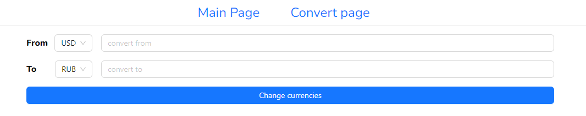

## Описание

Приложение для конвертации валют.  
Данные загружаются через API.  
Приложение состоит из двух страниц:

- На главной странице можно выбирать валюты, смотреть курс, доллара, евро и рубля по отношению к базовой валюте, а также принудительно обновлять данные котировок
  
- На странице конвертации можно конвертировать валюты друг в друга, а также менять их местами (например, usd <-> rub, rub <-> usd)
  

## Запуск

yarn watch

## Использованные технологии

1. React (hooks, custom hooks)
2. Redux
3. Ant Design
4. TypeScript
5. React Router (v5)

## Структура

```
project
├── README.md
├── node_modules
├── package.json
├── .gitignore
└── src
    ├── app
    └── components
        ├── loader
        ├── nav
        └── selectDropDown
    ├── features
    ├── fonts
    └── pages
        ├── convertPage
        └── mainPage
    ├── types
    └── utils
```
